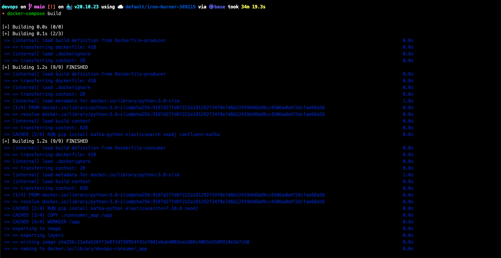
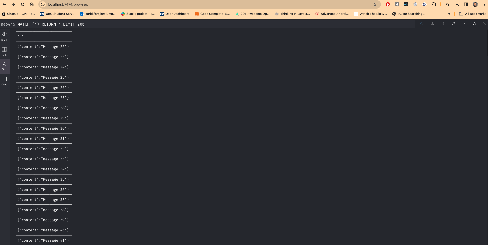
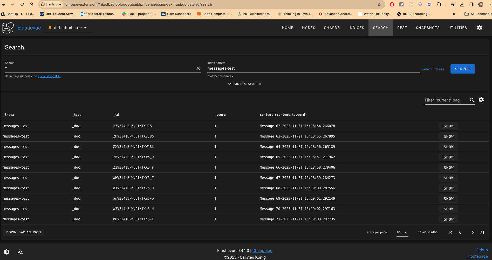
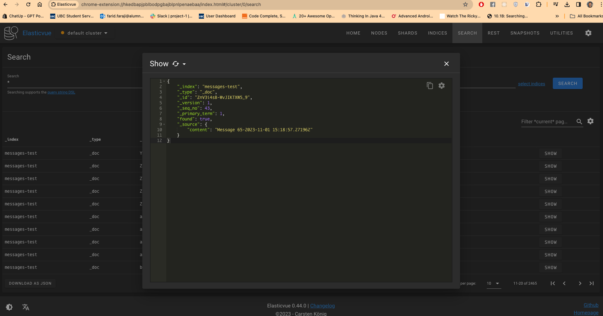
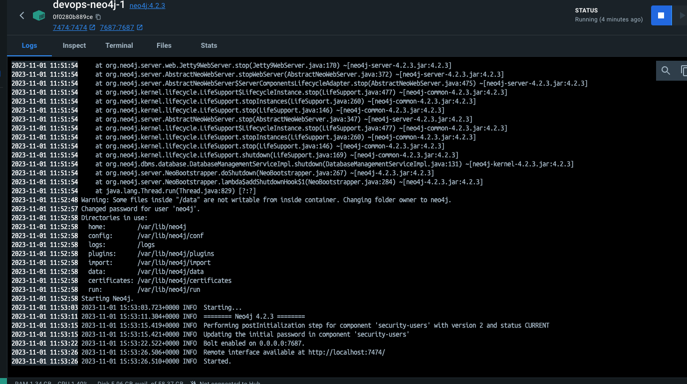
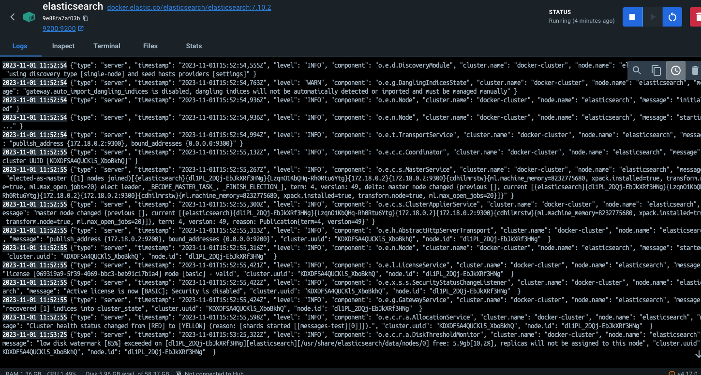
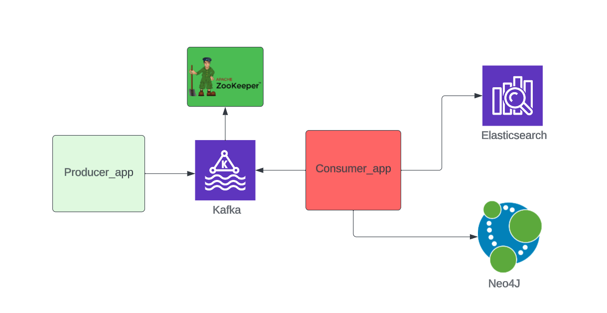
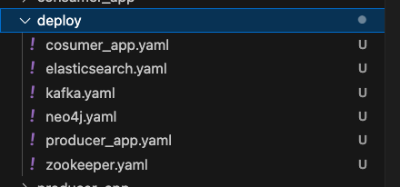
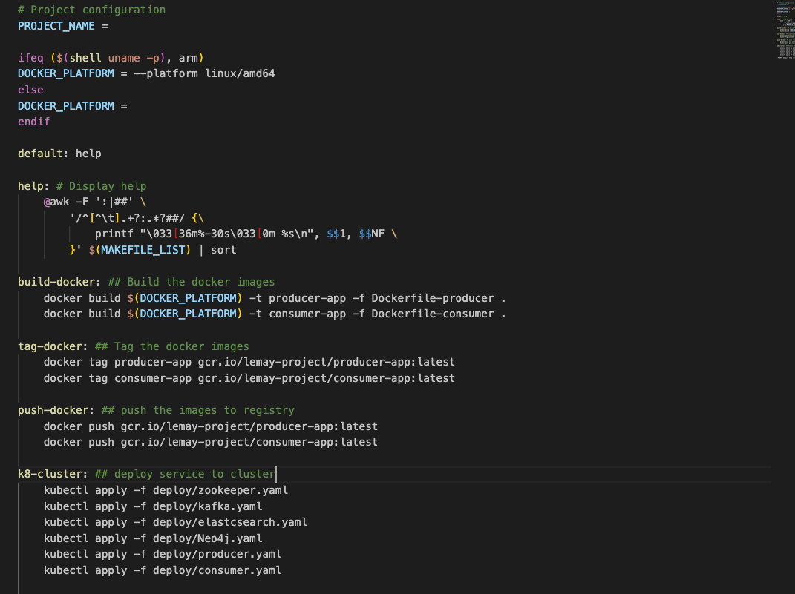

 

**Building the images:**

Using **docker-compose build** to build the images of the **producer\_app** and **consumer\_app** services

 

**Running the containers:**

Using the **docker-compose up** to run the docker containers.

Here are the running containers

 

The producer service creates the message sending it through Kafka to be consumed by the consumer service.

Here are the logs from the producer service.

And here are the logs from the consumer service.

 

**ElasticSearch and Neo4j**

The consumer service then inserts the messages into the ElasticSearch and the Neo4j services.

Here are examples of the data being populated in Neo4j

 

Below shows an example of content in the elasticsearch index being populated by the consumer

service.

 

**Logs Usage:**

The log files from each container play a critical role in troubleshooting issues within the pipeline. Consider an instance where unexpected data is detected in the Neo4j graph. In such a case, it is standard procedure to examine the consumer service's log files to confirm the

integrity of the messages being recorded. If the messages are not as anticipated, the investigation would
proceed to review the producer's log files to determine the content being generated.
Should an error or complication arise within Kafka or any ancillary service, the logs provide essential
diagnostics. By analyzing these logs, one can identify the issue and take appropriate measures to address

it.

 

 

**Explaining What the code does:**

**This project is composed of a suite of six microservices, exemplifying the quintessential**

**consumer-producer paradigm. Within this architecture, one microservice is responsible for**

**generating messages, while another is tasked with processing those messages. The system**

**leverages a robust messaging broker—specifically, Kafka, coupled with ZooKeeper—for**

**efficient message handling, ensuring the system's scalability and its capability to manage**

**substantial message sizes. This configuration enables the system to proficiently process a**

**high volume of sizeable requests.**

**Upon reception, the consumer microservice archives the incoming messages from Kafka into**

**a Neo4j graph database, which allows for sophisticated relationship-driven data insights.**

**Concurrently, Elasticsearch is employed to facilitate comprehensive full-text search**

**capabilities and to perform complex data analytics.**

 

**Using GKE and GCR instead of docker-compose:**

In order to run the services in a kubernetes cluster (using GKE in my example)
We will still need to build the docker images and in our case we tag the images with the correct tag to

be pushed into GCR then kubernetes will pull the images from the GCR.
We will have to write a kubernetes manifest for each service. You can see screenshots of these
manifests shown in the next pages.

You can check the manifest files in the deploy directory.

